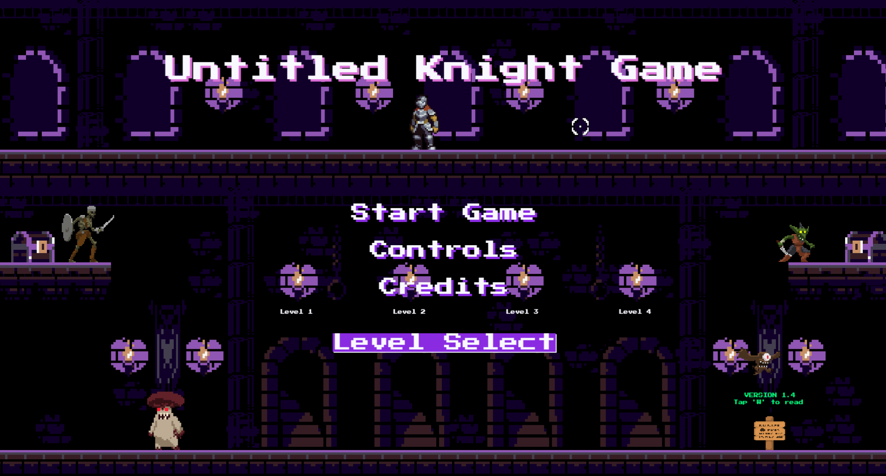
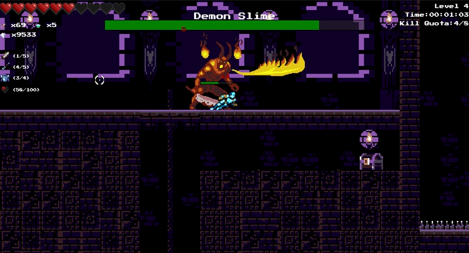
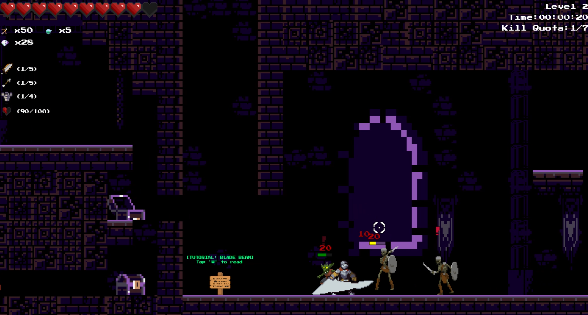
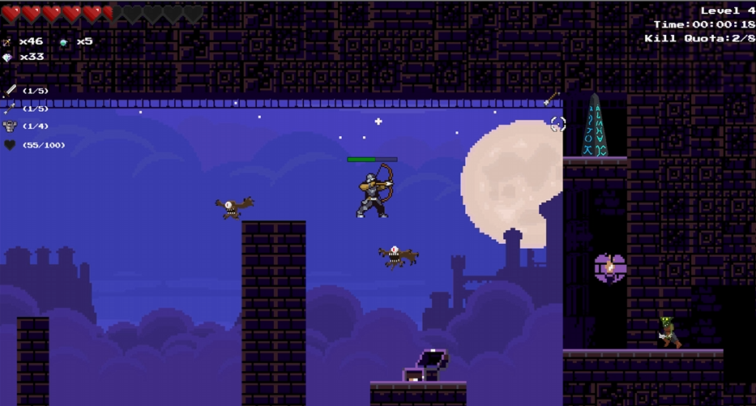

# TCSS491-Web-Game-Project: Untitled Knight Game
This is a 2D action platformer game where you play as a Knight. Explore 2D castle themed levels and take down monsters who stand in your path. You must save the day with an arsenal of tools at your disposal such as your trusty sword, bow and parkour skills! Explore the castle depths and loot the chests to upgrade your equipment at the shop!
Make your way though the dungeon and find out the source of this monster takeover!

Play it here: https://kenpai718.github.io/Untitled-Knight-Game/

Game Trailer: https://www.youtube.com/watch?v=vRtesQZ4C-o

This is a project for TCSS 491: Computational Worlds and developed in Winter 2022
